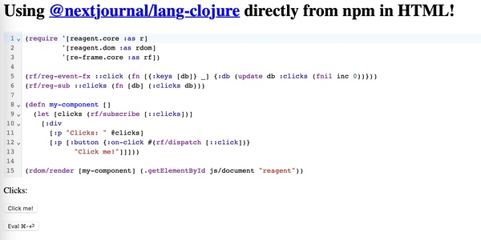
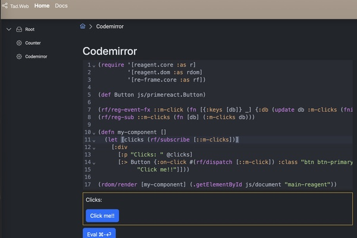

## Overview

This project is a lightweight full‑stack system built on [babashka](https://babashka.org) for the backend and [Scittle](https://babashka.org/scittle/)‑powered ClojureScript for the frontend. It emphasizes:

- Zero‑build development on both backend and frontend  
- Scriptable, composable architecture  
- Minimal dependencies with high leverage  
- Fast startup and easy deployment as a single executable  

The system builds for working with apps/services likes a shell for OS. 

## From simplicity to on-premise first

Thanks to the ideas from the [Borkent-universe](https://www.youtube.com/watch?v=119qVkHxPkM&t=1590s), this project evolves from pure simplicity toward an **on‑premise‑first** model with optional enhancements.

**Before:** the original Scittle CodeMirror demo
	https://babashka.org/scittle/codemirror.html
	

**After:** applying the **Quick Start**
	

* All frontend assets (JS/CSS) are mirrored locally
* A minimal http-kit server provides a fast, self‑contained runtime
* Bootstrap, bsdocs themes, and PrimeReact components are integrated
* Zero‑build workflow is preserved while enabling richer UI and offline capability

## How the pieces fit together

* Add a function to a backend map → a new page appears in the frontend
* Add a small script → frontend and backend gain a communication route
* Add more functions → they become reusable librarie

This repository focuses on the web UI.  Routing and library integration are demonstrated in Tad.Turnkey project (2026/03 release).

## Quick Start

Requiremens: macos and babashka installed

1. Download frontend resources

   ```bash
   $ bb dl.bb resources/jsdlv/*.txt
   ... downloading ...	
   ```

   This fetches all required JS/CSS assets (≈10 MB) into the `w/` directory.

2. Generate docs

   ```bash
   $ bb quickblog render
   Reading metadata for post: docs.md
   Writing blog/style.css
   Parsing Markdown for post: docs.md
   Processing markdown for file: c/qb/posts/docs.md
   Caching post to file: .work/prod/docs.md.pre-template.html
   Writing post: blog/docs.html
   Writing page: blog/tags/index.html
   Writing page: blog/tags/docs.html
   Writing page: blog/archive.html
   Writing page: blog/index.html
   Writing Clojure feed blog/planetclojure.xml
   Writing feed blog/atom.xml
   ```
   The generated site is placed under `blog/`.

3. Start the web server

   ```bash
   $ bb serv
   pwd: #object[java.io.File 0x54d196d0 /Users/tcc/wa/tad.web]
   URL: http://127.0.0.1:8888/
   2026-02-26T07:18:00.302+08 t4.local INFO [tad.web.svc:18] - Starting svc on port 8888
   ```

   Open the browser at:  **http://127.0.0.1:8888/**


## Roadmap

1. Documentation and unit tests
2. Windows and Linux verification
3. Security mechanisms
4. Support for nbb (Node.js) and Clojure (JVM)
5. Server‑to‑server communication
6. Integration with additional apps
